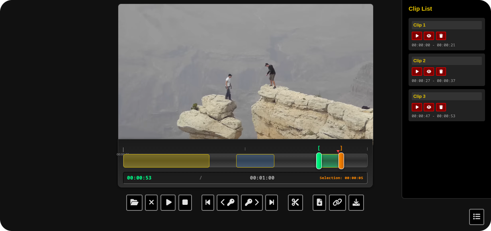
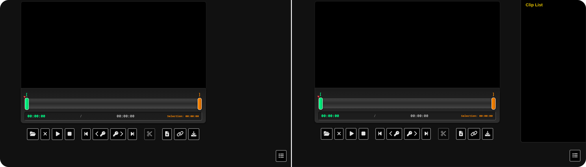

# KeyClip-Express

**KeyClip-Express** is a fast, browser-based video clipper and exporter, inspired by [LosslessCut](https://github.com/mifi/lossless-cut).

It lets you visually select, label, reorder, merge, and export multiple video clips with frame accuracy—right in your browser, powered by a local Node.js/Express/FFmpeg backend.

---

## Features

- **Import Video**: Load local videos for instant preview and editing.
- **Visual Timeline**: Select start/end points, drag handles, color-coded clips.
- **Multiple Clips**: Mark, label, and manage as many clips as you want before exporting.
- **Clip List Panel**: Organize, jump to, rename, and reorder your clips (arrow key support).
- **Batch Export**: Download all clips at once as a ZIP file, processed losslessly via FFmpeg.
- **Keyframe Navigation**: Jump to previous/next keyframe for perfect cuts.
- **Modern UI**: Clean, dark-themed interface with intuitive controls.
- **Keyboard Shortcuts**: Quickly control timeline and clip actions.
- **Clip Merging**: Concatenate your selected clips and export as a single file.
- **Drag-and-Drop Sorting**: Rearrange your clips visually in the clip list.

---

## Screenshots




---

## Getting Started

### 1. Prerequisites

- [Node.js](https://nodejs.org/) (v16+ recommended)
- [FFmpeg](https://ffmpeg.org/) installed and in your PATH

### 2. Installation

```bash
git clone https://github.com/jaycrav3ns/KeyClip-Express.git
cd KeyClip-Express
npm install
```

### 3. Start the Server

```bash
node server.js
```
The app will be available at [http://localhost:3001](http://localhost:3001).

---

## Keyboard Shortcuts

| Action         | Shortcut |
| -------------- | :------: |
| Cut Start      |    i     |
| Cut End        |    o     |
| Cut Clip       |    c     |
| Merge & Export |    m     |
| Move Clip Up   |  Arrow ↑ |
| Move Clip Down |  Arrow ↓ |

---

## Recent Improvements

- **Timeline color-coded clip blocks** (like LosslessCut)
- **Clip List blocks** (play button, improved layout)
- **Clip reordering** (arrow keys added)
- **Clip merging & export**
- **Keyboard shortcuts for timeline control**
- **Drag-and-drop sorting** for clips in the list

---

## Roadmap

- [x] Keyboard shortcuts for timeline and clip actions
- [x] Visual clip color-coding on timeline
- [x] Export clips nmerged (Save all clips as one file)
- [x] Drag-and-drop clip reordering
- [ ] Timeline cuts: clickable so "Export Range" is selectable.  
- [ ] Enhanced tooltips and accessibility
- [ ] Settings (output format, export options, subtitles)
- [ ] Drag-and-drop video loading
- [ ] More export formats (webm, gif, etc.)

**Pull requests and suggestions are very welcome!**  
Open an issue for bug reports or feature requests.

---

## License

CC0-1.0 license

---

### Credits

- Built by [jaycrav3ns](https://github.com/jaycrav3ns)
- Inspired by [LosslessCut](https://github.com/mifi/lossless-cut)
